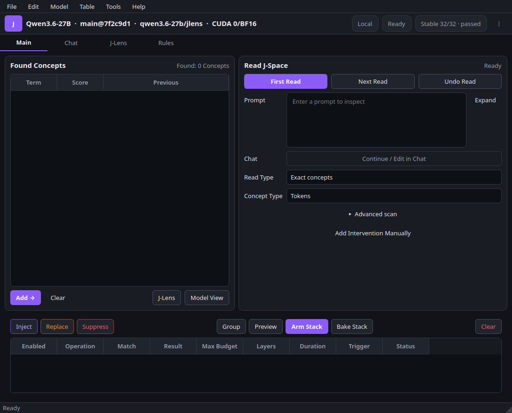

# J Studio

J Studio is a native desktop workbench for inspecting decoder-only language-model
J-space and applying calibrated word-level interventions. Its compact workflow is
modeled after Cheat Engine: select a model session, scan for concepts, refine the
result set, and queue inject, replace, or suppress operations in a visible stack.

The interface keeps that direct scanner workflow while presenting it as a modern
graphite/violet research workbench. Advanced scan fields stay out of the way until
requested, session and lens provenance remain visible as status pills, and Chat,
Rules, and the interactive J-Lens use one coherent visual system.



This branch contains the UI implementation, real Hugging Face/ROCm service backend,
an explicit deterministic demo mode, project format, and fail-closed QuickJS rules
sandbox. PyTorch, Transformers, and model execution stay behind a backend-neutral
service boundary and out of the GUI package.

## Current capabilities

- Streaming First Read / pause / next-token / resume / stop workflow
- Found-concept table with signed activation visualization
- Inject, replace, and suppress editors with minimum-effective-strength controls
- Ordered multi-token J-space injection and replacement with short causal probes
- Automatic selection of the lowest generated-output-effective strength within the
  configured maximum budget, with no alternate logit-steering fallback
- Duration-aware residual hooks, so Next Token edits do not repeat throughout an
  entire cached generation
- Chat and the repository's original interactive J-Lens slice visualization
- Model View, Layer Explorer, Influence Trace, Generation Trace, sweeps, experiments,
  snapshots, settings, light/dark palettes, and keyboard navigation
- Versioned, strict JSON projects; imported controls are disarmed by default
- Rules editor and test bench using one isolated spawned QuickJS process per run
- Real BF16 Qwen generation and residual readouts on ROCm
- Automatic progressive J-Lens fitting with resumable Preview and quality-gated Stable stages
- Prompt-boundary GPU scheduling so generation can run while fitting is in progress
- Deterministic fake services for development and UI testing through `--demo`

Only decoder-only models are in scope for the initial backend integration. The
service interfaces are deliberately model-agnostic so additional architectures and
remote workers can be added later.

## Run locally

Python 3.11 or newer is required.

```bash
git clone https://github.com/heterodoxin/J-Studio.git
cd J-Studio
python3.11 -m pip install --user -e '.[dev]' -e './jacobian-lens[dev]'
python3.11 -m jstudio
```

The default model is the locally cached `heterodoxin/qwen3-8b-apostate` checkpoint.
Use `--model ORG/MODEL --allow-download` for another compatible Hugging Face decoder.
Use `--demo` only when fixed deterministic test data is desired. If no compatible
cached lens exists, J Studio fits a Preview automatically on the already loaded model,
then refines it in the background. Preview enables inspection; interventions remain
disarmed until Stable passes held-out quality gates and geometry calibration. Fit
progress, cancellation, failure reasons, and resume controls are visible in the
session bar and J-Lens tab.

Cached lenses are keyed to the model, revision, estimator version, residual layout,
and target layer. An incompatible cache is not silently reused. Fitting projects
prompt Jacobians into the model's observed residual subspace, keeps split-half-stable
directions, selects transport shrinkage on held-out viewing cases, and uses ROCm/CUDA
VJP batch autotuning.

The J-Lens tab uses the original `jlens.vis` layer-by-position research surface,
including spatial text, By Layer/Position readouts, full-vocabulary ranks, pinned
rank heatmaps, and rank plots. It does not compress logits into saturated
`+0.99`/`+1.00` confidence values. The repository renderer is themed directly for
J Studio; exported HTML retains the same dark research surface and interactions.

For interventions, Strength is a maximum search budget rather than a guaranteed
applied dose. A value of `16` allows the bounded causal search to choose the minimum
effective strength. Multi-token targets are transported in token order across
decode steps. A request that produces no directional causal effect within the
budget fails explicitly instead of silently switching intervention methods.

## Verify

```bash
QT_QPA_PLATFORM=offscreen python3.11 -m pytest -q
python3.11 -m ruff check jstudio tests
python3.11 -m pytest -q jacobian-lens/tests
python3.11 -m ruff check jacobian-lens/jlens jacobian-lens/tests jacobian-lens/scripts
python3.11 -m jstudio --demo --screenshot /tmp/j-studio.png --quit-after 1000
```

The authoritative UI specification is
[`docs/superpowers/specs/2026-07-07-j-studio-ui-design.md`](docs/superpowers/specs/2026-07-07-j-studio-ui-design.md).

J Studio is an independent research tool and does not imply affiliation with
Anthropic, Neuronpedia, or the cited research authors.
